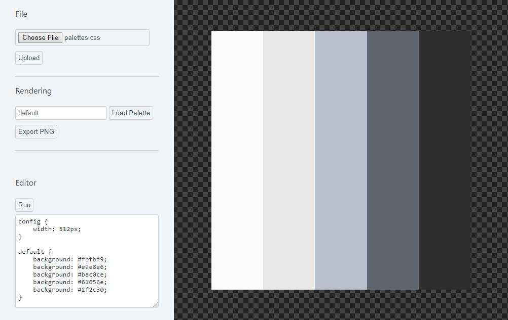

Palette Texture Generator
=========================

Creates colour palette textures using a `css` source file.

Example palette:

```css
/* palette definition */
blue_to_yellow {
    background: rgb(178, 232, 232);       /* first palette colour */
    background: rgb(178, 232, 206);       /* second palette colour */
    background: rgba(178, 232, 182, 0.9);
    background: hsl(93, 54%, 80%);
    background: #e2e8b2;
}
```

> Any valid `css` is valid when creating a palette, including gradients and images.

Configuration:

```css
config {
    width: 1024px; /* texture size */
}
```

&nbsp;


